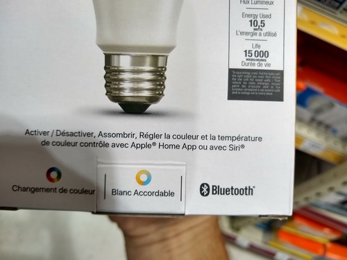
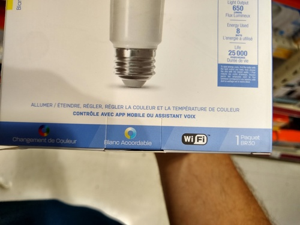
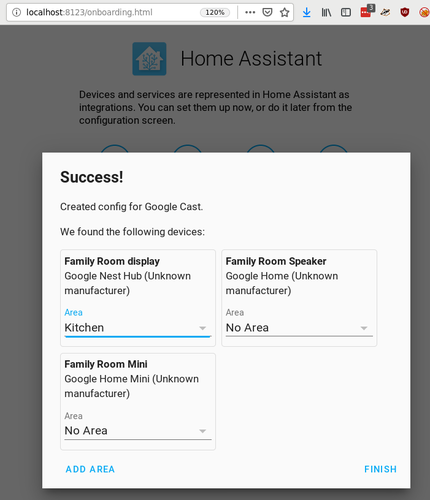
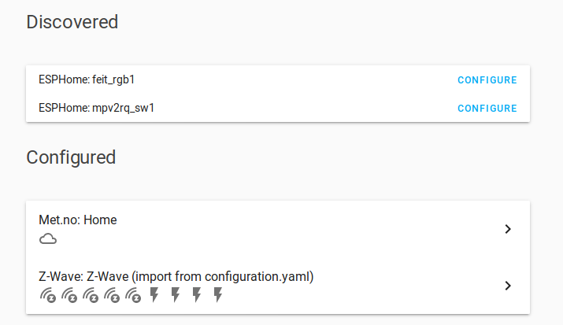
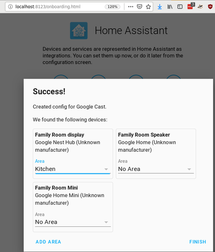

# GRPython HomeAutomation

## Cloudless Home Automation with Python

https://www.meetup.com/grpython/events/hbbjglyznbcc/

### Cloud Bad.

[https://www.irisbylowes.com/](https://www.irisbylowes.com/):

>> Thank You from Iris

>> The Iris smart home platform and related services were shut down March 31, 2019. Many devices used with Iris are compatible with other smart home platforms. For more information regarding the shutdown of the Iris platform, click here.

>> We appreciate your business and hope you continue to choose Lowe’s for your future smart home and home improvement needs.

[Report: Home builders ditch Nest products after Google takeover](https://arstechnica.com/gadgets/2019/10/report-home-builders-ditch-nest-products-after-google-takeover/)

[The death of “Works with Nest” begins now with Google account migrations](https://arstechnica.com/gadgets/2019/08/nest-users-can-now-voluntarily-euthanize-their-accounts-switch-to-google/)

### Configuration

- Wifi:
 - SSID: GRPUG_Demo
 - Pass: 0xdeadbeef
- HASS Instance
  - http://raspberrypi.local:8123 (zeroconf)
  - http://192.168.8.216:8123 (eth0)
  - http://192.168.8.241:8123 (wlan0)
  - User: GRPUG
  - Pass: 0xdeadbeef

## Technologies

- [Z-Wave](https://www.z-wave.com/)

  > Z-Wave is a wireless communications protocol used primarily for home automation. It is a mesh network using low-energy radio waves to communicate from appliance to appliance, allowing for wireless

  > Z-Wave uses the Part 15 unlicensed ISM band. It operates at 908.42 MHz in the U.S. and Canada but uses other frequencies in other countries depending on their regulations. The modulation is Gaussian frequency shift keying (FSK).

- [Zigbee](https://en.wikipedia.org/wiki/Zigbee

  > Zigbee is an IEEE 802.15.4-based specification for a suite of high-level communication protocols used to create personal area networks with small, low-power digital radios, such as for home automation, medical device data collection, and other low-power low-bandwidth needs, designed for small scale projects which need wireless connection. Hence, Zigbee is a low-power, low data rate, and close proximity (i.e., personal area) wireless ad hoc network.

  > Zigbee operates in … 2.4 GHz … worldwide; … 784 MHz in China, 868 MHz in Europe and 915 MHz in the USA and Australia … 2.4 GHz for most commercial Zigbee devices

- Wifi.

  It's Wifi.

  2.4GHz 5GHz.

- Bluetooth.

  It's Bluetooth.

  2.4Ghz

### Identifying

## Python Packages

- [Home Assistant](https://www.home-assistant.io/)

  >> Open source home automation that puts local control and privacy first. Powered by a worldwide community of tinkerers and DIY enthusiasts. Perfect to run on a Raspberry Pi or a local server.

- [ESPHome](https://esphome.io/)

  >> ESPHome is a system to control your ESP8266/ESP32 by simple yet powerful configuration files and control them remotely through Home Automation systems.

- [python-roku](https://github.com/jcarbaugh/python-roku)

  >> Screw remotes. Control your Roku via Python.

### Hardware:

FCC ID.

- [sonoff.tech](https://sonoff.tech/)

Feit Bulbs.

### Development Notes.

- Jupyter Notebook
- Geany/nano

### Code.

Hass

    nmap -p 8123 -oG - 192.168.8.1/24 | grep open

Webservers

    nmap -p 80 -oG - 192.168.8.1/24 | grep open

esphome

    nmap -p 8266 -oG - 192.168.8.1/24 | grep open
